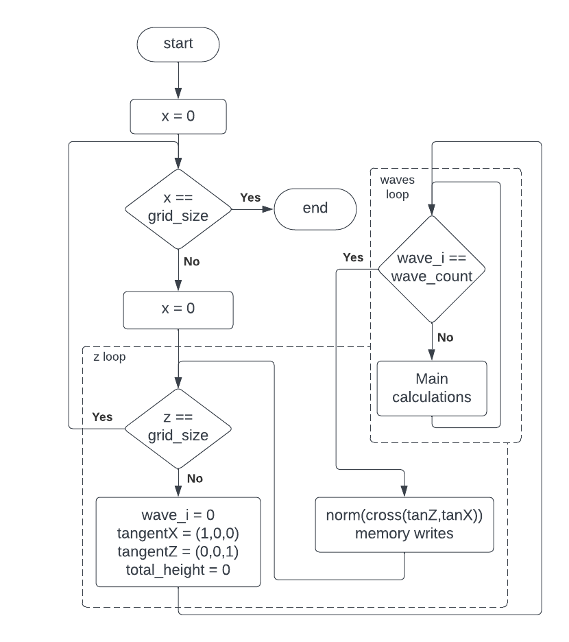
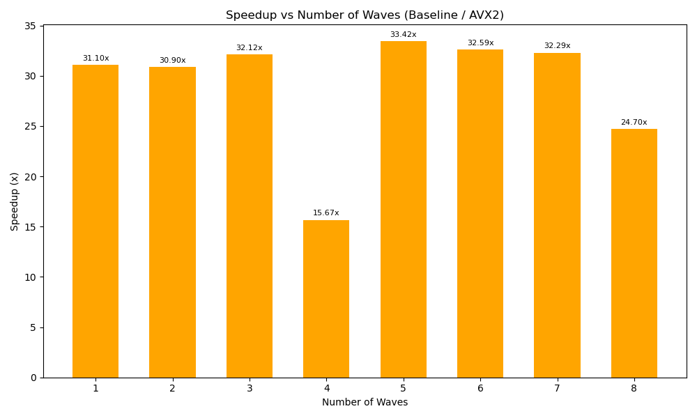
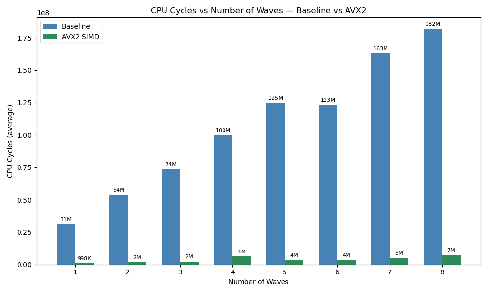

# Wave simulation optimization
Author: Marek Hric xhricma00  
Extensions: AVX, AVX2  
Environment: Ubuntu

## Table of contents
* [Optimization plan](#optimization-plan)
* [Loop](#loops)
* [Memory layout](#memory-layout)
* [Trigonometry functions](#trigonometry-functions)
* [Results](#results)
* [Further optimization ideas](#further-optimization-ideas)

## Optimization plan
I began by analyzing the algorithm by reimplementing it in C++. The new function (`own_cpp_updateVertices`) was simplified by:

* Uniting functionality to one function
* Removing duplicate `gerstnerWaves` loop
* Extracting duplicate calculations to variables
* Simplifying `dot`, `cross`, and `normalize` functions from the `glm` library
* Only passing `y` component array to functions since `x` and `z` component are unused 

Other plans are described in the following sections.

## Loops
Loops were designed with SIMD processing in mind. Given the significantly larger number of vertices compared to waves, and the likelihood that the wave count would not be a multiple of 8, I decided to process 8 vertices simultaneously. This approach reduces the number of loop iterations by a factor of 8.



## Memory layout

### Gerstner waves 
Vector of `GerstnerWave` structure was originally in AoS (Array of Structures) layout. I have converted it to SoA (Structure of Arrays) layout with SIMD processing in mind, but as I have later decided to process vertices simultaneously this change probably doesn't make any difference besides memory access in code.

### Tangents
`TangentX` and `TangentZ` are `glm::vec3<float>` in reference algorithm but can also be represented as 3 independent floats. As these tangents are calculated for every vertex, I have decided to process them as SoA in separate registers shown in the following table.

| Register | [255:224] | [223:192] | [191:170] | [169:128] | [127:96] | [95:64] | [63:32] | [31:0] |
| --- | --- | --- | --- | --- | --- | --- | --- | --- | 
**ymm2** | tanX.x[0] | tanX.x[1] | tanX.x[2] | tanX.x[3] | tanX.x[4] | tanX.x[5] | tanX.x[6] | tanX.x[7] |
**ymm3** | tanX.y[0] | tanX.y[1] | tanX.y[2] | tanX.y[3] | tanX.y[4] | tanX.y[5] | tanX.y[6] | tanX.y[7] |
**ymm4** | tanX.z[0] | tanX.z[1] | tanX.z[2] | tanX.z[3] | tanX.z[4] | tanX.z[5] | tanX.z[6] | tanX.z[7] |
**ymm5** | tanZ.x[0] | tanZ.x[1] | tanZ.x[2] | tanZ.x[3] | tanZ.x[4] | tanZ.x[5] | tanZ.x[6] | tanZ.x[7] |
**ymm6** | tanZ.y[0] | tanZ.y[1] | tanZ.y[2] | tanZ.y[3] | tanZ.y[4] | tanZ.y[5] | tanZ.y[6] | tanZ.y[7] |
**ymm7** | tanZ.z[0] | tanZ.z[1] | tanZ.z[2] | tanZ.z[3] | tanZ.z[4] | tanZ.z[5] | tanZ.z[6] | tanZ.z[7] |

This approach made it quite easy to rewrite C++ algorithm to assembly but the problem came with saving calculated normals to memory.  
Normals are saved as AoS and with AVX512 unavailable I had to come up with an algorithm recreating `vscatterdps` instruction.  
Final version looks like this:
```
vextractf128 xmm8, ymm10, 0

pextrd [rdi], xmm8, 0
pextrd [rdi + 12], xmm8, 1
pextrd [rdi + 24], xmm8, 2
pextrd [rdi + 36], xmm8, 3
```

This is repeated 2 times for each *ymm* register because of the "split" (`vextractf128` extracts high or low half from *ymm* register into *xmm* register) and 3 times as there are *x*, *y*, and *z* components of final vector.

## Trigonometry functions
The problem is that AVX(2) does not provide any instruction for sine or cosine, extracting every float to FPU and using `fsin` or `fcos` respectively would create a huge bottleneck.  
The solution is to use a lookup table (LUT).  
A precalculated LUT let me convert floats almost directly to their sine/cosine values. 

### Range reduction
To reduce range of floats from $[-\inf,\inf]$ to $[0,2\pi]$, I implemented this equation:  
$$
f \mod 2\pi \Leftrightarrow f - 2\pi \cdot \left\lfloor \frac{f}{2\pi} \right\rfloor
$$

### Conversion to index
The reduced floats then needed to be converted to LUT indices using following equation:  
$$
i = \text{round} \left( \frac{f \cdot (N-1)}{2\pi} \right)
$$

### Final values
With 8 LUT indices stored in register all that was left was to load values from the LUT.  
This was solved in the following macro (with similar macro for cosine):  
```
.macro sin dst src
    lut_idx \src

    # mask
    mov eax, -1
    vmovd xmm15, eax
    vpbroadcastd ymm15, xmm15

    mov rax, [rbp + 32]
    vgatherdps \dst, [rax + \src*4], ymm15
.endm
```

## Results
To evalute my implementation, I collected output of 5000 iterations with 1 to 8 waves.  

  
As we can see the algorithm is now approximately 30 times faster, especially when number of waves is not divisble by 4.  
I think the lower speedup with 4 and 8 waves is happening because of compilers optimization, but this is just a theory.  

  
In this graph we can see average CPU cycles per iteration for each tested wave count.  

## Further optimization ideas
* Precalculating vertex and time independent wave value `k`
* Different memory layout in codebase, which would free this function of converting between memory layouts (e.g. normals)
